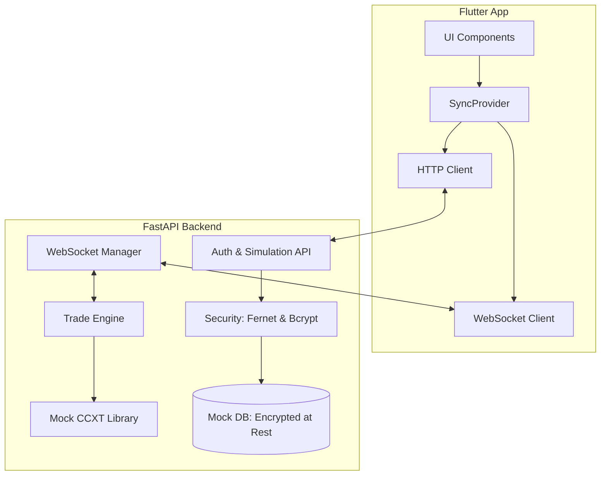

# Crypto Sync Architecture & Design Decisions

This document outlines the core architectural principles and technical decisions made during the development of the Crypto Sync platform.

## 🏗️ System Overview

Crypto Sync follows a decoupled architecture with a centralized **FastAPI Backend** acting as the coordinator and a **Flutter Mobile App** providing a real-time reactive interface.

## 🔒 Security Architecture

### API Key Protection
Sensitive exchange API keys and secrets are protected using a multi-layer strategy:
*   **Decrypted JIT**: Keys are stored encrypted using **AES-256 (Fernet)**. They are only decrypted in volatile memory (RAM) during the exact moment of trade execution.
*   **Zero-Knowledge Frontend**: The mobile application never stores or receives raw secret keys. It only handles public identifiers and masked values.

### Authentication
*   **JWT (JSON Web Tokens)**: All communication (REST and WebSocket) is secured via JWT.
*   **Bcrypt**: User passwords are salted and hashed using Bcrypt before storage to ensure they can never be recovered in plaintext.

### Biometric Lock
The mobile app implements a **Mandatory Biometric Hook**. When enabled, the local session token is protected by the device's hardware security (Secure Enclave/TrustZone).

## 📡 Real-Time Synchronization

Instead of inefficient polling, Crypto Sync uses a **Push-Based Architecture** via WebSockets:
*   **Heartbeat Mechanism**: Ensures connection liveness and handles silent disconnections.
*   **Exponential Backoff**: The Flutter client automatically attempts reconnection with increasing delays to ensure stability.
*   **State Projection**: The `SyncProvider` in Flutter acts as a projection of the backend's current state.
*   **Persistent Protocol Feed**: System logs are stored locally using **Hive**, ensuring historical audit trails survive app restarts and are re-populated instantly on launch.

## ⚙️ Trade Engine

### Mirroring Logic
*   **Parallel Broadcasting**: Trades are mirrored to "Slave" accounts concurrently to minimize slippage.
*   **Retry Engine**: A robust 3-retry mechanism handles transient exchange errors, with shimmering status indicators providing user feedback.

## 💳 Monetization & Access Control

The platform implements a **Hard-Enforced Subscription Model**:
*   **Server-Side Validation**: Account addition is validated against the user's active tier (Free, Basic, Pro). Attempts to exceed limits return a `403 Forbidden` response.
*   **Frontend Intercept**: The Flutter app dynamically adjusts the UI, disabling "Add Account" flows and displaying upgrade modals when tier limits are reached.
*   **Service Expiry**: Live sync is automatically suspended upon subscription expiry, marked by a system-wide `AccountSyncStatus.paused` state.

## 🌓 UI/UX Design System

*   **Bespoke UI Design System**: Instead of using off-the-shelf components, the app utilizes custom-built glassmorphic cards and pulsating pulse indicators to achieve a premium "institutional" aesthetic.
*   **Custom Graphics**: Leverages the `CustomPaint` API (e.g., `_SparklinePainter`) to render low-overhead vector decorations like portfolio sparklines without external assets.
*   **Micro-Animations**: Extensive use of `flutter_animate` for feedback on trade Mirroring and connection status.

## 🌐 Network Configuration (Remote vs Local)

*   **Decision**: Use a centralized `ApiConfig` class with automated URL generation.
*   **Rationale**: Allows seamless switching between Local Network (Physical Devices), Emulator testing, and Production (Remote) deployment without modifying multiple service files.
*   **Implementation**: 
    - `useLocalNetwork`: Toggles between emulator (10.0.2.2) and LAN IP.

## 🔄 Data Integration Strategy (Phase 5)

*   **Mock to Real Transition**: Successfully moved from static `MockData` to dynamic fetching from the FastAPI backend.
*   **Deep-Casting Safety**: Implemented a "Deep Casting" strategy across all UI data boundaries. By explicitly using `Map<String, dynamic>.from()`, we prevent the `_Map<dynamic, dynamic>` runtime errors common in heterogeneous Android environments.
*   **Centralized State**: `SyncProvider` remains the single source of truth.
*   **Tunneling Strategy**: **Cloudflare Tunnels** are utilized for remote access due to their superior stability, automatic reconnection logic, and low-latency performance compared to legacy SSH tunneling solutions.

## 🏗️ Production Hardening (Phase 5+)

### Model-Driven Decoupling
*   **Decision**: Introduced dedicated model files (`trade_models.dart`, `account_models.dart`) and completely eradicated the `MockData` dependency for UI logic.
*   **Rationale**: To ensure the app can scale to production levels with strong typing and a clear separation between business logic and the presentation layer.

### Proactive Connection Pulse
*   **Decision**: Reduced the WebSocket heartbeat from 30 seconds to **20 seconds**.
*   **Rationale**: To counter agressive idle-timeout policies implemented by modern proxies (Cloudflare/NGINX) and mobile ISPs, ensuring a robust, long-lived connection for real-time mirroring.

### App-Wide Offline Guard
*   **Decision**: Implemented a top-level `OfflineOverlay` wrapping the entire `MaterialApp`.
*   **Rationale**: To prevent user interaction during connectivity gaps, ensuring the app remains in a consistent state and preventing traders from acting based on outdated market or account data.

### Professional-Grade Accounts & UI
*   **Decision**: Introduced editable Master accounts and mandatory lot-sizing parameters (Fixed/Percentage).
*   **Rationale**: To provide institutional-grade control over mirroring risk.
*   **Implementation**: Utilized a specialized `StatusBadge` in `common_widgets.dart` and real-time dependency injection of `SubscriptionProvider` into Dashboard helper methods.
